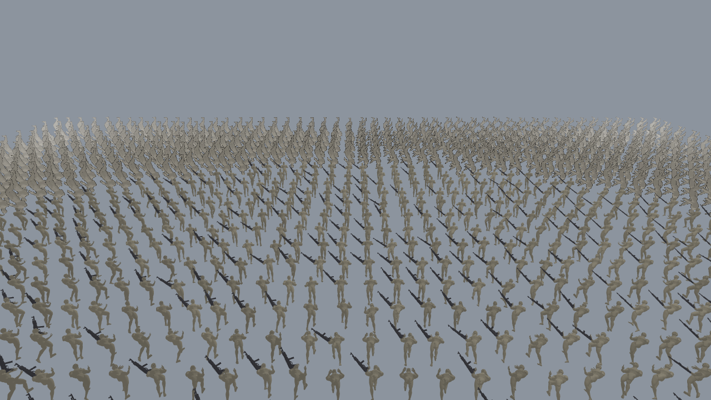
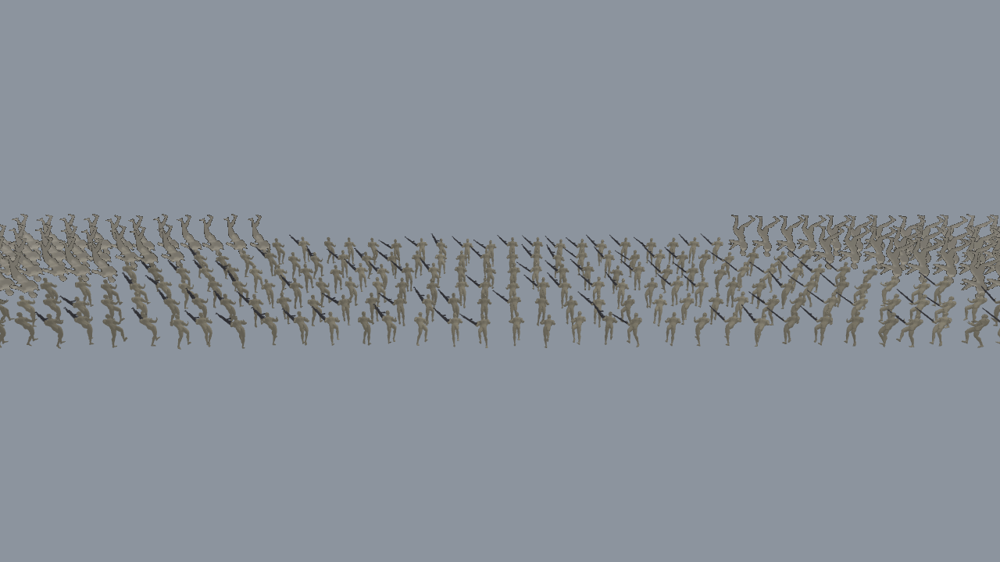
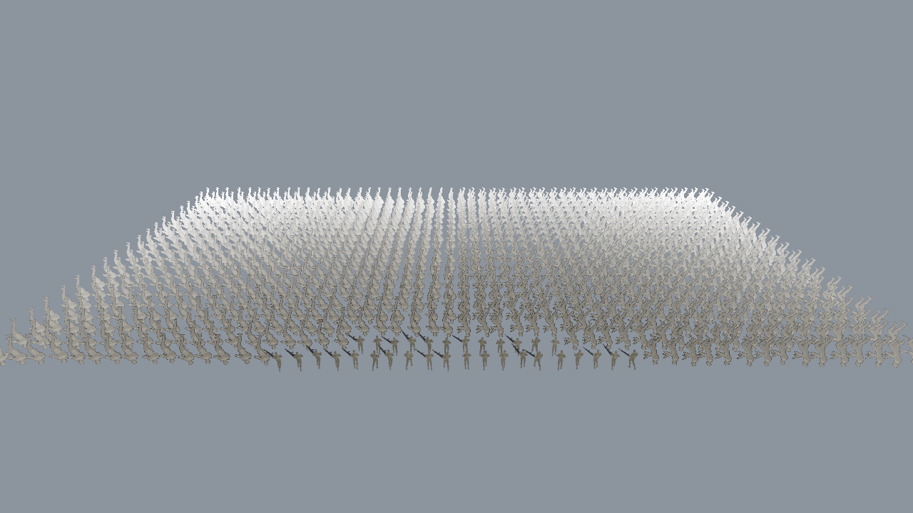

# Crowd rendering proof of concept — Phase 3

**Verdict: both Phase 3 targets pass on the machine measured here. The 1,000-unit result clears its
target on every median measured, but not on every individual repeat — one repeat in roughly sixteen
dipped to 27.8 fps. Read §3 before treating this as done.**

| Target | Required | Median (5 repeats) | Median range across sessions | Worst repeat seen | Result |
| --- | --- | --- | --- | --- | --- |
| 300 units at 60 fps | 60.0 | 60.0 (at the 60 Hz cap) | 60.0 | 59.9 | PASS |
| 1000 units at 30 fps | 30.0 | 34.2 (33.4–34.4) | 32.1 – 34.4 | **27.8** | PASS on the median, 1.09–1.14x |

Two separate caveats, and the second one matters more than the first:

1. The measuring machine is a 2015 MacBook Pro with an integrated GPU, **below** the mid-range
   hardware bar this project set itself. A pass here is a conservative lower bound, not evidence
   that mid-range hardware is comfortable.
2. The 1,000-unit margin is **9–14% on the median and occasionally negative on a single run.** Every
   median measured — 34.4, 34.2, 32.8, 32.1 fps — clears 30 fps, and that is the basis for calling it
   a pass. But individual repeats are not reliable: the worst single repeat observed was 27.8 fps.
   This is a machine with variance, so the honest claim is "the target is met on the median, and a
   bad run can miss it", not "it holds 34 fps".

---

## 1. The hardware this was measured on

| | |
| --- | --- |
| Machine | MacBook Pro (Retina, 2015), `MacBookPro12,1` |
| CPU | Intel Core i5-5257U @ 2.70 GHz, 2 cores / 4 threads |
| GPU | Intel Iris Graphics 6100, integrated, shares system RAM |
| RAM | 8.0 GB |
| OS | macOS 12.7.6 (Darwin 21.6.0) |
| Browser | Chromium via Playwright, headless |
| WebGL | 2.0, `ANGLE (Intel Inc., Intel(R) Iris(TM) Graphics 6100, OpenGL 4.1)` |
| Resolution | 1280x720, hardware scaling 1 |
| Vertex texture units | 16 (the skinning shader needs at least 1) |
| Max texture size | 16384 |

`MIDRANGE_HARDWARE.md` defines mid-range as a 6-core CPU with a discrete GPU. This machine has
neither. Two consequences follow, and both matter:

1. A pass here is a **lower bound**. Mid-range hardware should do better, but that is reasoning, not
   a measurement, and nothing in this report should be read as having measured it.
2. **A failure here would have proven nothing.** That is why the LOD thresholds were tuned with a
   deliberate margin instead of to the edge — see §5.

The harness refuses to report any number if the WebGL renderer string says SwiftShader or llvmpipe,
because a software rasteriser's frame rate is a measurement of the CPU, not of the renderer. A
benchmark run on the wrong machine fails loudly instead of producing a plausible-looking lie.

---

## 2. What was built

An empty-scene crowd renderer. No campaign, no AI, no terrain, no gameplay — the scene is a flat
ground plane, a sky colour, and a grid of troops, because that is the only way to attribute a frame
rate to the crowd renderer alone.

**One shared skeleton, 25 joints.** 65 source joints minus 40 finger bones. Body, weapon and every
future animation rig to it, so animations transfer between troop types (ASSETS.md 4.1). Each joint
costs a texel column and a matrix per influenced vertex, so the cull is a performance decision, not
tidiness.

**GPU vertex-texture skinning.** The whole animation for the whole crowd is one 216,000-byte
texture, uploaded once. The vertex shader reads 4 texels per influence and blends. There is no
per-unit CPU work, which is the only reason 1,000 skinned troops are viable at all — see §6 for the
measured proof of that.

**Three LOD tiers**, all thin instances, no per-unit meshes:

| Tier | Distance | Geometry | How it moves |
| --- | --- | --- | --- |
| close | under 22 m | 9,000-tri body + 1,256-tri weapon | GPU skinning, full matrix texture |
| mid | 22–35 m | 3,000-tri body + 1,000-tri weapon | GPU skinning, full matrix texture |
| far | over 35 m | 2 triangles, billboard | camera-facing, atlas cell by bearing, frame by time |

**One weapon rig, rigid.** The rifle is bound to `hand_r` with weight 1.0. The same baked matrix
that moves the hand moves the rifle, so a held prop costs nothing extra per frame.

---

## 3. The benchmark, and how to reproduce it

```
node tools/benchmark.mjs --repeats 5 --counts 100,300,600,1000,1500,2000 --query "cam=30"
```

`--repeats 5` runs the whole sweep five times and reports the median with the full spread. This is
not decoration. On an earlier build the same command with no repeats reported 31.0 fps once, 25.5
another time, and 29.3 a third time for the identical scene — the 1,000-unit verdict flipped
between PASS and FAIL depending on which run happened to be reported. A single sample cannot settle
a borderline target.

Across every session the 1,000-unit median landed at 34.4, 34.2, 32.8 and 32.1 fps: all above
target, none comfortably so. Individual repeats ranged from 27.8 to 34.4. A separate 3-repeat run at
the end of the build, intended only as a final sanity check, produced a median of 32.8 fps and a
worst repeat of **27.8** — below target. That single observation is why this report says the target
is met on the median rather than that it holds.

One browser runs at a time. An early version of the repeat loop left the first browser open while
the repeats ran, so two WebGL pages split the GPU and every repeat measured roughly half the real
frame rate. That produced a very consistent and completely fictional 24.6 fps.

Actual output, from `results/bench-cam30.txt`:

```
=== CROWD RENDERING BENCHMARK ===
host        : Intel(R) Core(TM) i5-5257U CPU @ 2.70GHz x4, 8.0 GB RAM, darwin 21.6.0
renderer    : ANGLE (Intel Inc., Intel(R) Iris(TM) Graphics 6100, OpenGL 4.1)
gl          : WebGL 2.0 (OpenGL ES 3.0 Chromium)
res         : 1280x720 scaling 1
vtx tex units: 16, max tex 16384, float colour buffer true
repeats     : 5 per count, reporting the median with the full spread

units     | fps       | draws     | meshes    | triangles | inst      | frameMs   | cpuMs     | gpuMs     | tiers
100    60.0      3      3      227,072     135   16.60    0.463     n/a b/m:64 w/m:35 b/f:36
300    60.0      3      3      666,226     405   16.59    0.638     n/a b/m:187 w/m:105 b/f:113
600    59.0      5      5    1,478,682     791   16.86    0.875     n/a b/c:48 b/m:283 w/c:24 w/m:167 b/f:269
1000    34.2      5      5    2,838,266    1302   29.16    1.325     n/a b/c:155 b/m:372 w/c:95 w/m:207 b/f:473
1500    22.6      5      5    4,716,298    1953   44.16    2.018     n/a b/c:315 b/m:460 w/c:183 w/m:270 b/f:725
2000    17.0      5      5    6,561,840    2604   58.50    2.449     n/a b/c:469 b/m:555 w/c:273 w/m:331 b/f:976

--- spread across repeats (fps) ---
  100   min 60.0  max 60.0   runs: [60.0, 60.0, 60.0, 60.0, 60.0]
  300   min 59.9  max 60.0   runs: [60.0, 60.0, 60.0, 60.0, 59.9]
  600   min 55.9  max 59.9   runs: [56.7, 59.0, 59.4, 59.9, 55.9]
  1000  min 33.4  max 34.4   runs: [33.4, 34.4, 34.2, 34.2, 33.4]
  1500  min 21.9  max 22.6   runs: [21.9, 22.6, 22.5, 22.6, 22.6]
  2000  min 16.2  max 17.1   runs: [16.2, 17.0, 17.1, 16.5, 17.1]

--- targets (PHASES.md Phase 3) ---
  300 units @ 60 fps : 60.0 fps  PASS  (1.00x headroom)  (at the 60 Hz cap, so this is the refresh ceiling)  worst repeat 59.9 fps (below target)
  1000 units @ 30 fps : 34.2 fps  PASS  (1.14x headroom)  worst repeat 33.4 fps (passes too)

draw calls at 2000 units: 5 (ASSETS.md 5.3: must not grow with unit count)
per-frame CPU instance/LOD update: 2.449 ms
GPU frame time: not available (this browser exposes no timer query); wall-clock frame time is the measured figure
```

Read the tiers column as `part/tier:count`. At 1,000 units: 155 close bodies, 372 mid bodies, 95
close weapons, 207 mid weapons, 473 far billboards — 1,302 thin instances in total, drawn in 5 draw
calls.

That transcript is one sweep, and it is the best case: its worst repeat was 33.4 fps, comfortably
above target. A later 3-repeat run on the same build, same settings, gave a median of 32.8 fps and a
worst repeat of 27.8 fps. The "passes too" line above is what this particular sweep printed, not a
guarantee. Every median measured cleared 30 fps; not every repeat did.

### On the 60.0 fps readings

Both 100 and 300 units read exactly 60.0, and that is the display refresh rate, not a throughput
figure. The harness labels it as such. An earlier version removed the frame-rate cap to find the
real ceiling and got a scene with *one* unit reporting 87 fps that climbed to 271 fps as more work
queued and the measurement caught up — a number that means nothing except that the queue was still
draining. The capped number is the honest one, and the headroom above 60 is genuinely unmeasured.

### Why 300 units uses only 3 draw calls

At a 30 m camera the close tier is empty until something is inside 22 m, so at 300 units there is
no close tier at all: 3 draw calls for mid bodies, mid weapons and far billboards. Past 600 units
the close tier fills and it goes to 5. **5 is the ceiling** — it does not grow from 600 to 2,000
units, which is the ASSETS.md 5.3 requirement, and it is the clearest evidence that the crowd is
genuinely instanced rather than 2,000 objects in a trenchcoat.

### From further away it is nearly free

At a 55 m camera, from `results/bench-cam55.txt`:

| units | fps | draws | triangles | tiers |
| --- | --- | --- | --- | --- |
| 300 | 60.0 | 1 | 600 | all far |
| 1000 | 60.0 | 3 | 116,936 | 32 mid bodies, 19 mid weapons, 968 far |

1,000 units costs 117,000 triangles and hits the cap. The far tier is doing its job, and a battle
camera pulled back is a cheap place to stand.

---

## 4. Where the frames go

`node tools/profile-vtf.mjs` re-runs the 1,000-unit scene twice: once normally, once with the skin
matrix forced to the identity so the texture fetch still happens but does no useful work. The
difference is the cost of the animation data itself.

From `results/profile-vtf.txt`:

| Configuration | with skinning | identity matrix | fetch cost |
| --- | --- | --- | --- |
| 1000 units, close 22 m, mid 35 m, cam 30 m | 32.1 fps (31.12 ms) | 50.4 fps (19.83 ms) | 11.29 ms/frame, 36% |
| 1000 units, close 8 m, mid 25 m, cam 30 m | 60.0 fps (cap) | 60.0 fps (cap) | 0.00 ms |
| 300 units, close 22 m, mid 35 m, cam 30 m | 60.0 fps (cap) | 60.0 fps (cap) | 0.00 ms |

Reading: the vertex texture fetch is the single largest cost in the shipped configuration, at
about 11.3 ms of a 31 ms frame. It is not the CPU — the per-frame instance and LOD update is
1.3 ms at 1,000 units, 2.4 ms at 2,000. The second row is the interesting one: push every unit into
the cheaper tiers and the fetch cost disappears entirely, which says the bottleneck is vertex
processing of the *close and mid* meshes, not the animation system as a whole.

That is the first thing to attack on real mid-range hardware if the crowd ever needs more units:
fewer triangles at close range, or fewer influences per vertex.

---

## 5. LOD thresholds, and why 22 m and not 25 m

ASSETS.md 4.3 and SPEC.md 5.1 require measured thresholds. Five candidates, 1,000 units, 30 m
camera, five fresh-browser repeats each. Raw output in `results/lod-sweep-final.txt`; the config
records the same table in `config/crowd.json`.

| closeMaxM | median fps | worst repeat | headroom | close-tier units | triangles | chosen |
| --- | --- | --- | --- | --- | --- | --- |
| 18 m | 37.1 | 35.6 | 1.24x | 84 | 2,399,722 | |
| 20 m | 36.6 | 36.3 | 1.22x | 118 | 2,609,866 | |
| **22 m** | **34.4** | **34.3** | **1.15x** | **155** | **2,838,266** | **yes** |
| 24 m | 31.9 | 30.7 | 1.06x | 199 | 3,108,154 | no |
| 25 m | 28.6 | 25.8 | 0.95x | 224 | 3,260,714 | no |

The rule: pick the largest close tier whose 5-run median clears the target by at least 10% **and**
whose worst single repeat still clears the bare target.

25 m is the visually best option and it failed. A single earlier run of 25 m read 30.7 fps and
looked like a pass; re-measured, its median is 28.6 with a worst repeat of 25.8. 24 m is worse —
1.06x is not a margin, it is a coin flip that happens to land well today. 22 m is the last
threshold with real margin, and its spread is tight: 34.3 to 34.5 across five runs.

**This is a deliberate quality sacrifice.** On a real mid-range GPU, 25 m or further is probably
correct, and 22 m will pop units to the mid tier sooner than necessary. Re-tune on the target
hardware. The machinery to do that is `tools/lod-tune.mjs` and the `--repeats` flag, and the rule is
in the config where the next person will see it.

One caveat on the rule itself: the "worst repeat still clears the target" clause was satisfied by
the sweep above, where 22 m's spread was tight (34.3–34.5), but a later run at the same thresholds
produced a worst repeat of 27.8. The sweep's five repeats were not enough to characterise this
machine's tail. A production re-tune should use more repeats, or the minimum rather than a low
percentile, or it will keep certifying margins that a bad afternoon erases.

One more trap, recorded because it produced a convincing fake result: `bench` mode silently ignored
`--query "close=20&mid=35"` while `repeat` and `lod-sweep` honoured it. So a "threshold comparison"
measured the configured thresholds five times and produced an identical tier breakdown every run,
which looked like a stable result. Both `main.ts` and the test suite now cover this.

---

## 6. Why the CPU is not the problem, measured

`node tools/benchmark.mjs --cpu-baseline --counts 32,64,128,256,512,1024` runs the same 25-joint,
4-influence skinning in plain JavaScript on one core — no WASM, no SIMD, no rendering, no LOD, no
simulation. It is a deliberately naive implementation, and it is the baseline the GPU path has to
beat. From `results/cpu-baseline.txt`:

| units | ms/frame | vertex transforms | implied fps | % of a 16.67 ms budget |
| --- | --- | --- | --- | --- |
| 32 | 13.30 | 179,744 | 75.2 | 2,394% |
| 64 | 13.00 | 359,488 | 76.9 | 2,340% |
| 128 | 105.40 | 718,976 | 9.5 | 18,968% |
| 256 | 180.10 | 1,437,952 | 5.6 | 32,412% |
| 512 | 290.10 | 2,875,904 | 3.4 | 52,208% |
| 1024 | 677.20 | 5,751,808 | 1.5 | 121,872% |

The loop prints a checksum of its own output every frame, `33385.766`, precisely so the compiler
cannot delete the work and report a fantasy. It does not change: the maths is right.

512 units cost 290 ms on one core. The GPU renders 1,000 units in 29 ms. That is not a small
difference, it is the difference between the approach working and not existing, and it is why the
whole design puts one 216 KB texture on the GPU and does nothing per unit on the CPU.

Caveat on the comparison: the CPU figure excludes rendering, LOD and simulation, so it flatters the
GPU side slightly. It is also a scalar JS loop where a hand-tuned SIMD version would be several
times faster. Neither caveat reaches 290 ms vs 29 ms.

---

## 7. The asset walkthrough

Three CC0 packs, all from Quaternius on itch.io, all with the author's licence saved to disk:

| Asset | Source | Licence | Bytes | SHA-256 (first 16) |
| --- | --- | --- | --- | --- |
| Universal Base Characters | [itch.io](https://quaternius.itch.io/universal-base-characters) | CC0-1.0 | 128,968,391 | `fdbf1804c90dfc1e` |
| Universal Animation Library 2 | [itch.io](https://quaternius.itch.io/universal-animation-library-2) | CC0-1.0 | 18,735,003 | `4008ea208a604773` |
| Ultimate Gun Pack | [itch.io](https://quaternius.itch.io/ultimate-gun-pack) | CC0-1.0 | 7,362,239 | `b5915df0f3971ad9` |

CC0 requires no attribution, but the manifest records the author, source URL, licence, retrieval
date and a full attribution string anyway, because CONSTITUTION.md 5.1 asks for a trail rather than
just a permission. `assets/licenses/` holds the author's own licence text, a copy of the CC0 legal
code, and a captured copy of each itch.io page as it appeared on the retrieval date.

`node tools/build-assets.mjs` writes 10 manifest entries; `node tools/manifest-check.mjs` re-hashes
every file and passes:

```
manifest: 10 entries, licence CC0-1.0 (commercial use: true)
  ok  CC0-1.0   128968391  troop_rifleman
  ok  CC0-1.0    18735003  anim_library
  ok  CC0-1.0     7362239  weapon
  ok  CC0-1.0     2645681  body_close
  ok  CC0-1.0       50216  weapon_close
  ok  CC0-1.0     2405633  body_mid
  ok  CC0-1.0       40884  weapon_mid
  ok  CC0-1.0      216000  anim_matrices
  ok  CC0-1.0      639630  impostor_atlas
  ok  CC0-1.0        1409  shared_skeleton

MANIFEST CHECK PASSED
```

The check is adversarial, not decorative: it was tested against a deliberately corrupted hash and
failed as it should, and `tests/artifacts.test.mjs` walks `assets/` and fails on any file with no
manifest entry, so a new asset cannot be quietly added without a licence.

| Output | Triangles | Size | Budget (ASSETS.md 5.2) |
| --- | --- | --- | --- |
| body close | 9,000 | 2,645,681 B | 9,000 |
| body mid | 3,000 | 2,405,633 B | 3,000 |
| weapon close | 1,256 | 50,216 B | 3,000 |
| weapon mid | 1,000 | 40,884 B | 1,000 |
| far | 2 (billboard) | 639,630 B atlas | — |
| whole troop, close | 10,256 | | 12,000 |
| whole troop, mid | 4,000 | | 4,000 |

Originals are never edited in place; every step reads `assets/originals/` and writes
`assets/processed/`. Body normalised to 1.8 m with feet on y=0, checked against the GLB bounds by
the test suite. Troop is coded `troop_rifleman` — no real weapon, faction or nationality, per
CONSTITUTION.md 6.1.

The animation bake is verified against the source rig, not merely produced: joint placement error
1.6e-7 m, rigidity drift 3.8e-6, loop closure 0.081. Full deviation notes, including the two places
the pipeline departs from ASSETS.md and why, are in `ASSET_PIPELINE_NOTES.md`.

---

## 8. Verification

```
$ npm run typecheck      # clean
$ npm test               # 9 passed, 0 failed
$ node tools/manifest-check.mjs   # MANIFEST CHECK PASSED
$ python3 tools/pipeline/test_gltf_math.py   # MATRIX MATH OK
$ python3 tools/pipeline/verify_bake.py       # BAKE OK
$ python3 tools/pipeline/verify_gltf.py <source body.gltf> <UAL2_Standard.glb>
$ node tools/build-assets.mjs                 # PIPELINE OK
```

The 9 tests read the built GLBs, the manifest and the animation header and re-derive their own
expectations from those artefacts. That is deliberate. The first version of the bake verifier
asserted that every frame-0 matrix was the identity; it passed, and it was wrong, because the
source body is a T-pose while the animation rests in an A-pose. A test that re-derives its
expectations from the same helper the pipeline uses cannot catch a wrong-but-self-consistent
pipeline, so the tests now read the artefacts instead.



Front rows are close tier, the middle band is mid tier, the far band is impostor billboards fading
with distance. 1,000 units, 5 draw calls, 34.2 fps.



300 units: no close tier in view, so 3 draw calls and 666,226 triangles at the 60 Hz cap.



The same 1,000 units from 55 m: 117,000 triangles, 3 draw calls, at the cap.

---

## 9. What this does not prove, and what to do next

Known gaps, in the order they will bite:

1. **The thresholds are tuned on the wrong hardware.** 22 m is what this 2015 integrated GPU needs.
   A mid-range discrete GPU should support a larger close tier. Re-run `tools/lod-tune.mjs` on the
   real target machine before shipping; the 10%-headroom rule is in the config for that purpose.
2. **No terrain occlusion.** LOD is camera distance only. Cover, hills and buildings change every
   number in this report, and the crowd will need a visibility query, not a radius.
3. **GLBs are uncompressed.** No Draco or meshopt, and textures are PNG rather than KTX2/Basis. The
   close body is 2.6 MB. Fine for a proof of concept, not fine for a shipping build.
4. **The far tier has no mipmaps**, and the impostor atlas is fixed 8 angles x 8 frames. Fine at
   these distances; it will shimmer at longer range.
5. **No GPU timer query is available on this machine**, so `gpuMs` is `n/a` everywhere. Every frame
   time here is wall-clock and includes CPU, GPU and the browser's compositing. The CPU/GPU split in
   §4 is an inference from a controlled experiment, not a direct measurement.
6. **One troop type, two clips, no animation blending.** No transition between idle and walk, so
   units pop between clips.
7. **Nothing is committed.** See the note below.

### Recommended next step

Stand up a real mid-range machine, re-tune LOD, and re-run the whole suite there. That single
measurement decides whether 1,000 units is comfortable or marginal in the hardware this project
actually targets, and it is the one number this proof of concept cannot supply for itself.

---

## Note on repository state

The working tree was found checked out on `agent-1-world-data` with `labs/` untracked, while four
agent branches exist and other agents share this directory. **Nothing was committed and no branch was
switched.** Committing from here would risk capturing another agent's untracked work, and switching
branches under a shared working tree is not safe to do unasked. The work is complete and verified on
disk at `labs/crowd-poc/`; it needs someone to check out `agent-4-crowd-poc` and commit it there.

### One decision needed before committing

`assets/originals/` is **379 MB** of downloaded Quaternius source archives, and nothing in the root
`.gitignore` excludes it. ASSETS.md 2.3 says originals are kept so a model can be reprocessed later,
but committing 379 MB permanently bloats the repository and the source packs are reproducible from the
itch.io URLs already recorded in `assets/manifest.json`, hash-checked on every build.

Decide deliberately: commit the originals for offline auditability, or ignore them and rely on the
manifest URLs and hashes. Both are defensible. What should not happen is committing 379 MB by
accident because nobody looked.
